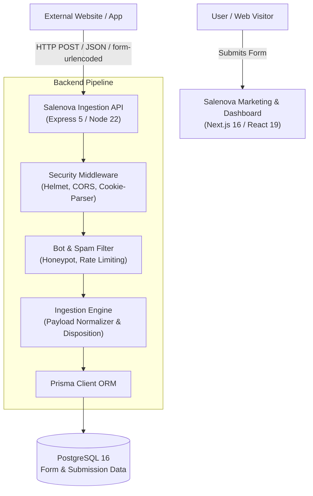
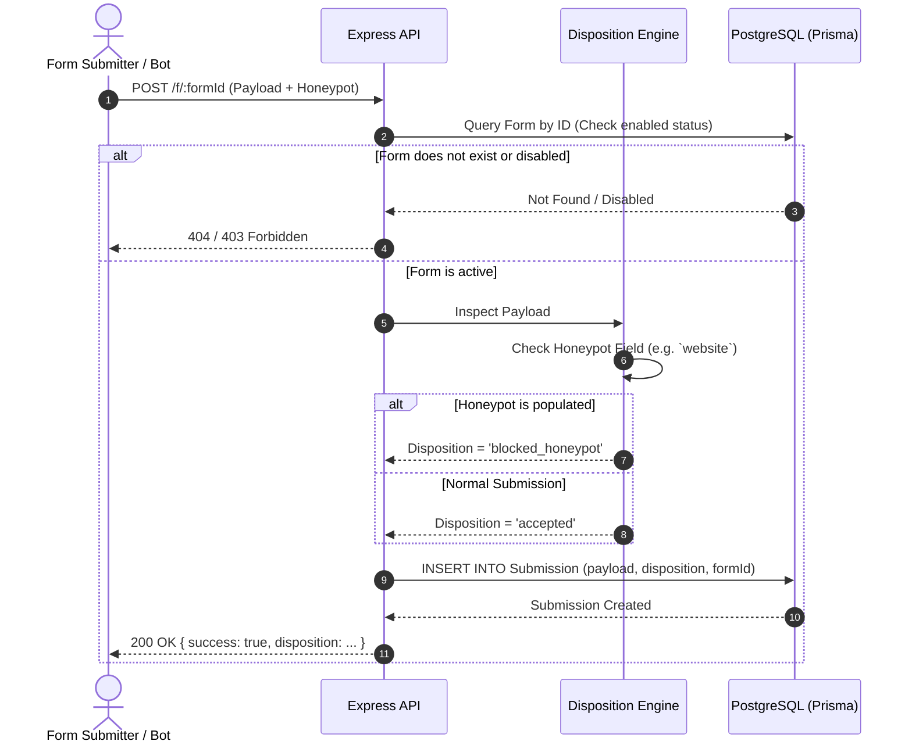

# System Architecture & Technical Design

This document details the software architecture, data flow, component boundaries, and security model for the **Salenova** platform.

---

## 1. Architectural Goals

Salenova is engineered to solve two main problems:
1. **Developer Velocity**: Eliminate the repetitive work of writing bespoke backend handlers, databases, and validation routines for marketing and product forms.
2. **Lead Integrity & Deliverability**: Automatically filter out automated bots, spam crawlers, and junk inquiries before they contaminate CRM databases or notify sales teams.

---

## 2. High-Level Architecture

The system follows a modern decoupled architecture where frontend presentation is separated from backend persistence and ingestion:



---

## 3. Monorepo Organization

Salenova uses a clean workspace separation between the client and server components:

```
crm/
├── client/          # Frontend Web Application (Next.js 16, React 19, Tailwind CSS v4)
├── server/          # REST Ingestion API & Database Services (Express 5, Prisma 6)
├── docs/            # Architecture, API specifications, and database references
└── .github/         # Continuous integration and repository templates
```

### 3.1 Client Architecture (`/client`)

The frontend application adopts a **Feature-Driven Design** pattern:
- **`src/app/`**: Next.js App Router route groups:
  - `(marketing)`: The high-converting public landing page, interactive try-it playground, feature matrix, and pricing calculator.
  - `(auth)`: Owner and workspace onboarding (signup/login flows) styled with frosted-glass dark aesthetic.
- **`src/features/`**: Self-contained domain modules:
  - `marketing/`: Feature components (`hero.tsx`, `features-grid.tsx`, `benefits-cross.tsx`, `try-it.tsx`, `pricing.tsx`, `faq.tsx`).
  - `auth/`: Forms, validation schemas, and onboarding banners.
- **`src/shared/`**: Common cross-cutting UI elements (`Button`, `Input`, `Checkbox`) and utility helpers (`cn` / class merging).

### 3.2 Server Architecture (`/server`)

The backend is built with Express 5 on Node.js 22 using TypeScript:
- **Middleware Chain**:
  - `helmet`: Sets secure HTTP response headers.
  - `cors`: Handles cross-origin requests from configured frontend domains.
  - `express.json()`: Parses incoming JSON payloads.
  - `cookie-parser`: Manages secure session and token cookies.
- **Database Access**: Managed strictly through **Prisma ORM**, ensuring type-safe query generation and migration tracking.

---

## 4. Request Lifecycle & Lead Disposition

When a form submission reaches Salenova, it undergoes the following lifecycle:



### Dispositions:
- **`accepted`**: Passed all security validations and ready for CRM review.
- **`blocked_honeypot`**: Form payload contained data in hidden honeypot fields.
- **`rate_limited`**: Submissions originating from an IP exceeding frequency thresholds.
- **`disposable_email`**: Submissions with temporary or throwaway domain addresses.

---

## 5. Security & Spam Mitigation Model

1. **Invisible Honeypot**:
   Legitimate users cannot see or interact with honeypot fields hidden via CSS and `tabindex="-1"`. Automated web crawlers fill out all form inputs blindly, triggering automatic isolation.
2. **CORS Restrictions**:
   Standard public endpoints permit cross-origin form submissions while administrative endpoints require authenticated origins.
3. **Prepared Statements**:
   Prisma ensures parameterized queries, preventing SQL injection vulnerabilities.
4. **Environment Isolation**:
   No credentials or database URLs are hardcoded in version control. All configuration is loaded via environment variables and checked in `.env.example`.

---

## 6. Deployment & Containerization

The backend service is containerized via Docker and orchestrated through Docker Compose:
- **`db` container**: Alpine-based PostgreSQL 16 image with persistent volume mapping (`pgdata`) and native health checks (`pg_isready`).
- **`api` container**: Multi-stage Node 22 slim build, with automated migration execution on startup before booting the server with `tsx`.
