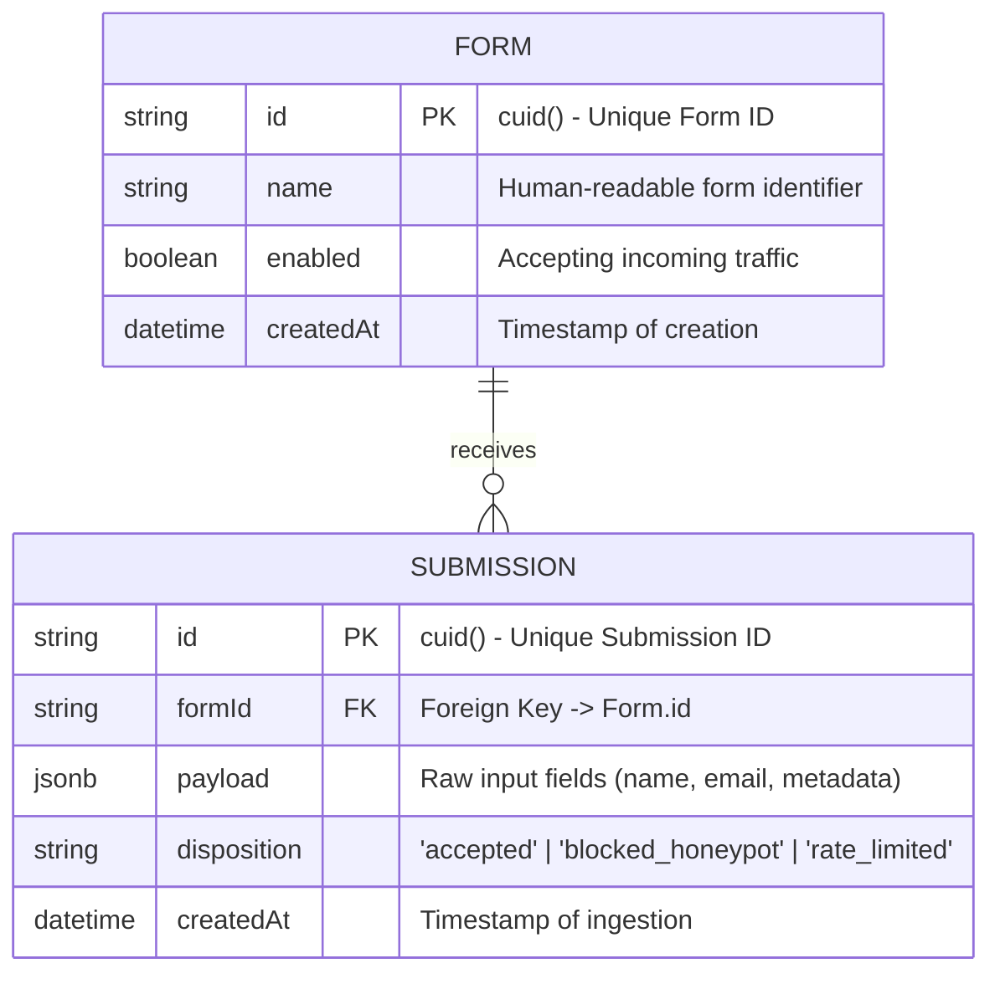

# Database Schema & Data Models

Salenova uses **PostgreSQL 16** with **Prisma ORM** as its data layer. This document details the database schema, entity relationships, indexing strategy, and migration workflows.

---

## 1. Entity Relationship Diagram (ERD)



---

## 2. Model Definitions

### 2.1 `Form` Model

Represents a logical form container created by a workspace owner (e.g. "Main Landing Page Contact Form", "Pricing Demo Request").

| Column | Type | Constraints | Description |
| :--- | :--- | :--- | :--- |
| `id` | `String` | `@id @default(cuid())` | Unique identifier generated as a collision-resistant CUID. |
| `name` | `String` | Non-nullable | Name assigned by user for dashboard management. |
| `enabled` | `Boolean` | `@default(true)` | Toggle switch to temporarily disable or pause ingestion. |
| `createdAt` | `DateTime` | `@default(now())` | Creation timestamp. |
| `submissions`| `Submission[]`| Relation | Array of submissions linked to this form. |

---

### 2.2 `Submission` Model

Stores every ingested lead or form submission attempt.

| Column | Type | Constraints | Description |
| :--- | :--- | :--- | :--- |
| `id` | `String` | `@id @default(cuid())` | Unique submission identifier. |
| `formId` | `String` | Foreign Key | References `Form.id` with `onDelete: Cascade`. |
| `payload` | `Json` | PostgreSQL `JSONB` | Arbitrary key-value pairs submitted in the form request. |
| `disposition` | `String` | `@default("accepted")` | Categorization tag (`accepted`, `blocked_honeypot`, etc.). |
| `createdAt` | `DateTime` | `@default(now())` | Timestamp when the entry arrived at the API. |

---

## 3. Indexing & Performance Strategy

To ensure high-throughput query performance even with millions of submissions, Salenova implements targeted indexes:

```prisma
model Submission {
  // ...
  @@index([formId, createdAt])
}
```

### Why this index matters:
- The dominant query pattern in CRM and dashboard views is:
  ```sql
  SELECT * FROM "Submission"
  WHERE "formId" = $1
  ORDER BY "createdAt" DESC
  LIMIT 50;
  ```
- The composite B-tree index on `(formId, createdAt)` allows the database engine to perform an index scan rather than a full table scan, providing $O(\log N)$ access times for pagination and dashboard listing.

### Foreign Key Cascades:
- `onDelete: Cascade` ensures that when a form is deleted, its associated submission history is automatically cleaned up in an atomic transaction, preventing orphan records.

---

## 4. Querying JSONB Payloads

Because form inputs can vary widely from form to form (e.g., standard contact forms vs multi-step surveys), Salenova uses PostgreSQL's native `JSONB` data type for the `payload` column.

This allows developers to query nested fields inside SQL or Prisma:

```typescript
// Example: Find submissions where email ends with @acme.com
const acmeSubmissions = await prisma.submission.findMany({
  where: {
    formId: "form_123",
    payload: {
      path: ["email"],
      string_contains: "@acme.com",
    },
  },
});
```

---

## 5. Prisma Management Commands

All database commands should be executed from the `server/` directory:

```bash
# Generate Prisma Client after modifying schema.prisma
pnpm run db:generate

# Create and apply a new migration during local development
pnpm run db:migrate

# Apply all pending migrations (used in Docker and CI/CD pipelines)
pnpm run db:deploy

# Launch interactive visual database browser (Prisma Studio)
pnpm run db:studio
```
